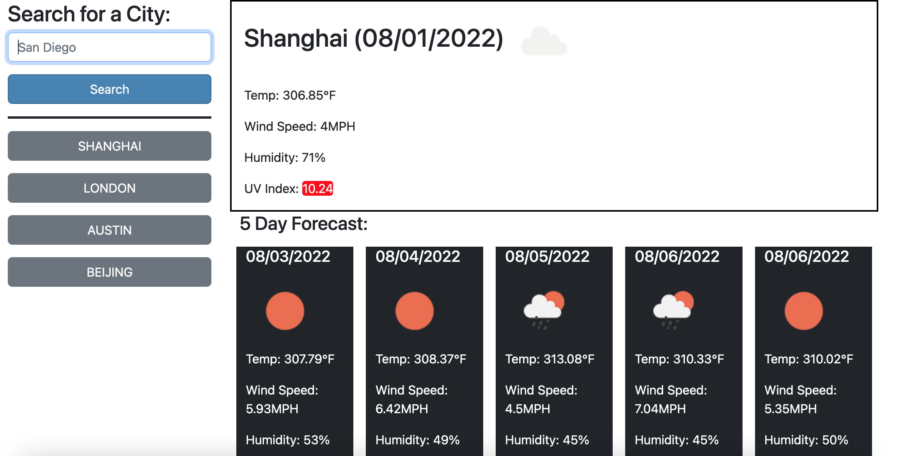

# weatherGrabberER

## Description
Webpage that loads the weather for given input cities. a large block comes up with the current weather, and smaller blocks detail the 5-day forecast. This was very good practice for working with APIs and APIkeys.

## Installation
Access the project at https://emilyerose.github.io/weatherGrabberER/

## Usage
Type into the search bar to search for a new city. Click any of your 'history' city buttons to pull up their weather. Functionality is demonstrated here:

## Credits
Credit goes to the Open Weather API here https://openweathermap.org/ for the source of the weather data and the geolocator that links a city name to a longitude/lattitude.

## License
none applicable